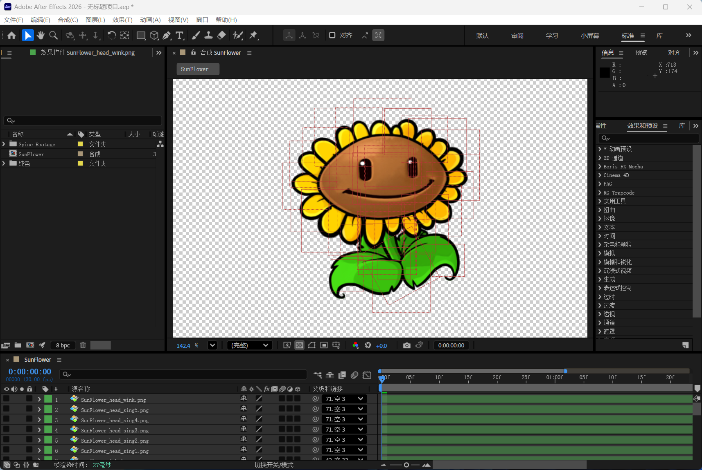
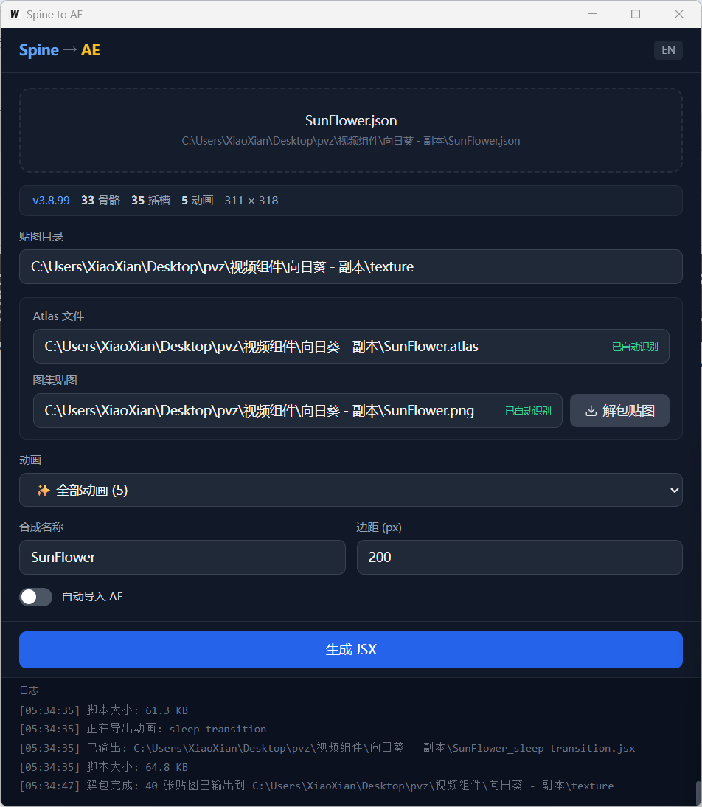

# Spine → AE



将 Spine 骨骼动画转换为 After Effects 工程 — 带图形界面，拖入即用。由UP主 [@大不6仙](https://space.bilibili.com/12724008) 开发。

Convert Spine skeletal animations into After Effects projects — GUI included, drag & drop.

**[中文](#中文)** | **[English](#english)**

---

## 中文

### 功能特性

- **图形界面** — 拖放 Spine 文件即可使用，无需命令行
- **Spine 3.7 / 3.8 JSON & .skel** — 自动将 `.skel` 转为 JSON
- **加权网格** — 多骨骼加权顶点，通过表达式近似变形
- **动画关键帧** — 旋转、平移、缩放，贝塞尔缓动
- **Atlas 解包** — 自动识别 atlas / 图集贴图，一键解包为独立纹理
- **批量导出** — 可一次导出全部动画
- **自动导入 AE** — 生成 JSX 后可直接在 After Effects 中执行

### 使用方法

1. 下载 [Releases](https://github.com/XiaoXianThis/spine-to-ae/releases) 中的可执行文件
2. 运行 `SpineToAE.exe`
3. 将 `.json` 或 `.skel` 文件拖入窗口
4. 按需调整参数，点击 **生成 JSX**



#### 界面说明

| 区域 | 说明 |
|------|------|
| **拖放区** | 将 Spine `.json` / `.skel` 拖入此处加载 |
| **贴图目录** | 自动设为 `<json 目录>/texture`，可手动修改 |
| **Atlas 文件 / 图集贴图** | 自动识别，支持一键解包为独立纹理 |
| **动画** | 选择单个动画或「全部动画」批量导出 |
| **合成名称 / 边距** | AE 合成名及画布边距 |
| **自动导入 AE** | 开启后自动检测 AfterFX.exe 并执行生成的脚本 |

> **注意**：`.skel` 文件需要同目录下存在 `skeleton.exe`（放在 `bin/` 目录即可）。

### 下载

访问 [Releases](https://github.com/XiaoXianThis/spine-to-ae/releases) 获取预编译版本。

---

## English

### Features

- **GUI** — Drag & drop Spine files, no command line needed
- **Spine 3.7 / 3.8 JSON & .skel** — Auto-converts `.skel` to JSON
- **Weighted Meshes** — Multi-bone weighted vertices with expression-based deformation
- **Animation Keyframes** — Rotate, Translate, Scale with bezier easing
- **Atlas Unpacking** — Auto-detects atlas / page image, one-click unpack to individual textures
- **Batch Export** — Export all animations at once
- **Auto Import to AE** — Run generated JSX directly in After Effects

### Usage

1. Download the executable from [Releases](https://github.com/XiaoXianThis/spine-to-ae/releases)
2. Run `SpineToAE.exe`
3. Drag a `.json` or `.skel` file into the window
4. Adjust settings as needed, click **Generate JSX**


#### UI Overview

| Area | Description |
|------|-------------|
| **Drop Zone** | Drag Spine `.json` / `.skel` files here |
| **Texture Dir** | Auto-set to `<json_dir>/texture`, editable |
| **Atlas / Page Image** | Auto-detected; one-click unpack to individual textures |
| **Animation** | Select a single animation or "All Animations" for batch export |
| **Comp Name / Padding** | AE composition name and canvas padding |
| **Auto Import AE** | Auto-detects AfterFX.exe and runs the generated script |

> **Note**: `.skel` files require `skeleton.exe` in the `bin/` directory next to the app.

### Download

Visit [Releases](https://github.com/XiaoXianThis/spine-to-ae/releases) for pre-built binaries.

---

## 开发文档 / Development

### 技术栈 / Tech Stack

- **后端 / Backend**: Go + [Wails v2](https://wails.io)
- **前端 / Frontend**: React + Tailwind CSS + Vite

### 从源码构建 / Build from Source

```bash
git clone https://github.com/XiaoXianThis/spine-to-ae.git
cd spine-to-ae/go

# 安装前端依赖 / Install frontend deps
cd frontend && npm install && cd ..

# 开发模式 / Dev mode
wails dev

# 构建 / Build
wails build
```

### 工作原理 / How It Works

1. **解析** — 读取 Spine JSON，规范化骨骼、插槽、皮肤、附件数据
2. **骨骼世界变换** — 递归计算层次骨骼矩阵
3. **网格处理** — UV 质心锚点、世界边界框缩放、每骨骼加权贡献
4. **脚本生成** — 输出 ExtendScript (.jsx)：
   - 创建 AE 合成（正确尺寸）
   - 导入纹理素材
   - 骨骼 → 空图层（100×100，锚点 50,50）
   - 附件 → 图像图层
   - 加权网格 → 位置/旋转表达式
   - 动画关键帧 + 贝塞尔缓动

### 坐标系统 / Coordinate Systems

| System | Y-Axis | Rotation | Origin |
|--------|--------|----------|--------|
| Spine | Up (+Y) | CCW positive | Skeleton root (0,0) |
| AE | Down (+Y) | CW positive | Comp top-left |

- **Position**: `AE_x = bone.x`, `AE_y = -bone.y`
- **Rotation**: `AE_rotation = -Spine_rotation`
- **Scale**: `AE_scale = [scaleX × 100, scaleY × 100]`

### 网格变形方案 / Mesh Deformation

AE 不支持脚本级网格变形，本工具使用表达式近似：

- **位置** — 贡献骨骼世界位置的加权平均
- **旋转** — 骨骼世界旋转的加权平均（相对 setup pose 差值）
- **缩放** — 网格世界边界框推算

### ⚠️ Wails 拖拽开发注意 / Drag & Drop Notes

Wails v2 在 Windows/WebView2 上的拖拽链路较长，修改时必须满足以下 5 个条件，否则拖拽会静默失效：

1. **`main.go`**: `EnableFileDrop: true` + `DisableWebViewDrop: false`
2. **前端调用** `OnFileDrop(callback, true)` — 唯一注册 HTML5 drop 监听的入口；`useDropTarget` 必须为 `true`
3. **根元素** CSS 自定义属性 `--wails-drop-target: drop`（通过 `style` 内联设置，HTML attribute 无效）
4. **注册前** 调用 `OnFileDropOff()` 清除旧注册（内部 `flags.registered` 会跳过重复注册）
5. **`useEffect([], ...)`** + `useRef` 保持回调最新，避免 React 重渲染反复注销注册

**拖拽链路 / Drop Chain (Windows/WebView2):**

```
HTML5 drop → Wails JS onDrop → chrome.webview.postMessageWithAdditionalObjects
→ Go 解析文件路径 → Go 触发 "wails:file-drop" → JS EventsOn 回调
```

### 引用

- [SpineSkeletonDataConverter](https://github.com/wang606/SpineSkeletonDataConverter) - 用于将 Spine 的 .skel 文件转换为 JSON 格式

### License

MIT
